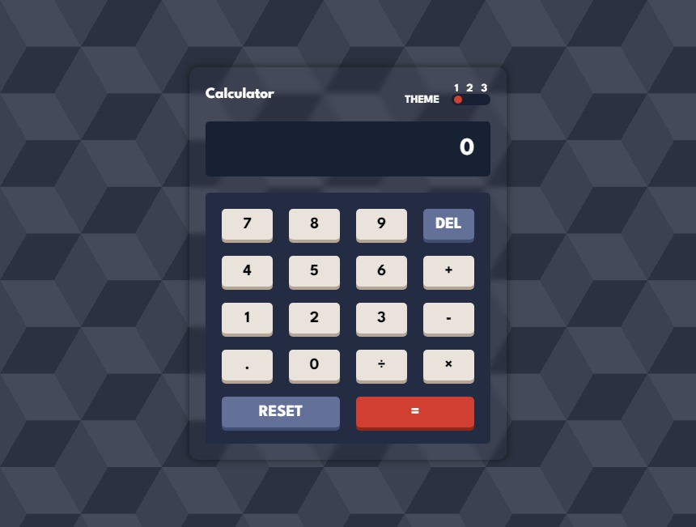

# Frontend Mentor - Calculator app solution

This is a solution to the [Calculator app challenge on Frontend Mentor](https://www.frontendmentor.io/challenges/calculator-app-9lteq5N29).

## Table of contents

- [Overview](#overview)
  - [The challenge](#the-challenge)
  - [Screenshot](#screenshot)
  - [Links](#links)
- [My process](#my-process)
  - [Built with](#built-with)
- [Author](#author)

## Overview

### The challenge

Users should be able to:

- See the size of the elements adjust based on their device's screen size
- Perform mathmatical operations like addition, subtraction, multiplication, and division
- Adjust the color theme based on their preference

### Screenshot

### Links

- Solution URL: [Solution URL](https://www.frontendmentor.io/solutions/calculator-app-using-vanilla-js-tqXLaeRnVR)
- Live Site URL: [Live site URL](https://ayoubrabiae.github.io/calculator/)

## My process

### Built with

- CSS custom properties
- Flexbox
- CSS Grid
- Mobile-first workflow
- JavaScript

## Author

- Frontend Mentor - [@Ayoubrabiae](https://www.frontendmentor.io/profile/Ayoubrabiae)
- Linkedin - [Ayoub RABIYA](https://www.linkedin.com/in/ayoub-rabiya/)
